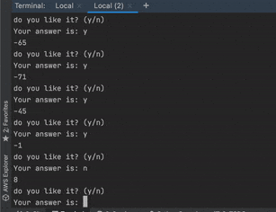

# cortex-multiarmed-bandit

Serving ML models in a high-load manner with cortex and traffic splitter.

With this template, you can deploy real-time recommender systems behind the multi-armed bandit and balance traffic. 
No knowledge of Kubernetes or autoscaling is needed! It's all there out of the box.

# Project description

Here an example multi-armed bandit with two models behind: one return only 
postirive random numbers, second – only negatives.

Also simple `executor.py` provided. It allows you to execute requests to the models and provide some feedback on it. 



# Step-by-step

## 0. Setup AWS account and make

Pls, make sure that you have AWS CLI installed. 

For more information read [this](https://docs.aws.amazon.com/cli/latest/userguide/cli-chap-install.html).

## 1. Install `cortex` 0.39.1 or greater


```bash
# install the CLI
pip install cortex
```

! More actual information you can find here: https://docs.cortex.dev

## 2. Setup cluster 

```bash
cortex cluster up
```

## 3. Deploy models

```bash
cortex deploy --env aws
```

# Different models

We have two separate files: `model_a.py` and `model_b.py`. Model A returns random positive numbers, Model B – negative.
So, we always can identify the model – it will help us later.
 
## Build model images

For each model we have to create separate docker container. 
For this purpose we use [Docker's multi-stage builds](https://docs.docker.com/develop/develop-images/multistage-build/).

This images use the base, but serves different models.

For building models:
```bash
docker build . --target model-a -t cortex-bandit:model-a
docker build . --target model-b -t cortex-bandit:model-b
```

## Check images

To make sure image working correctly we can run it locally:
```bash
docker run --rm -it -p 8080:8080 cortex-bandit:model-a
``` 

And do some requests:
```bash
curl -X POST -H "Content-Type: application/json" -d '{"msg": "hello world"}' localhost:8080
```

We will se something like this:
```
$ curl -X POST -H "Content-Type: application/json" -d '{"msg": "hello world"}' localhost:8080
78
```

## Push image


1. Make sure, that aws cli tool is installed
2. Login into AWS ECR
    ```bash
    aws ecr get-login-password --region us-east-2 | docker login --username AWS --password-stdin <AWS_ACCOUNT_ID>.dkr.ecr.us-east-2.amazonaws.com
    ``` 
3. Create repository (needed only once)
    ```bash
    aws ecr create-repository --repository-name cortex-bandit
    ```
3. Tag image
    ```bash
    docker tag cortex-bandit:model-a <AWS_ACCOUNT_ID>.dkr.ecr.us-east-2.amazonaws.com/cortex-bandit:model-a
    ```
4. Push it
    ```bash
    docker push <AWS_ACCOUNT_ID>.dkr.ecr.us-east-2.amazonaws.com/cortex-bandit:model-a
    ```
